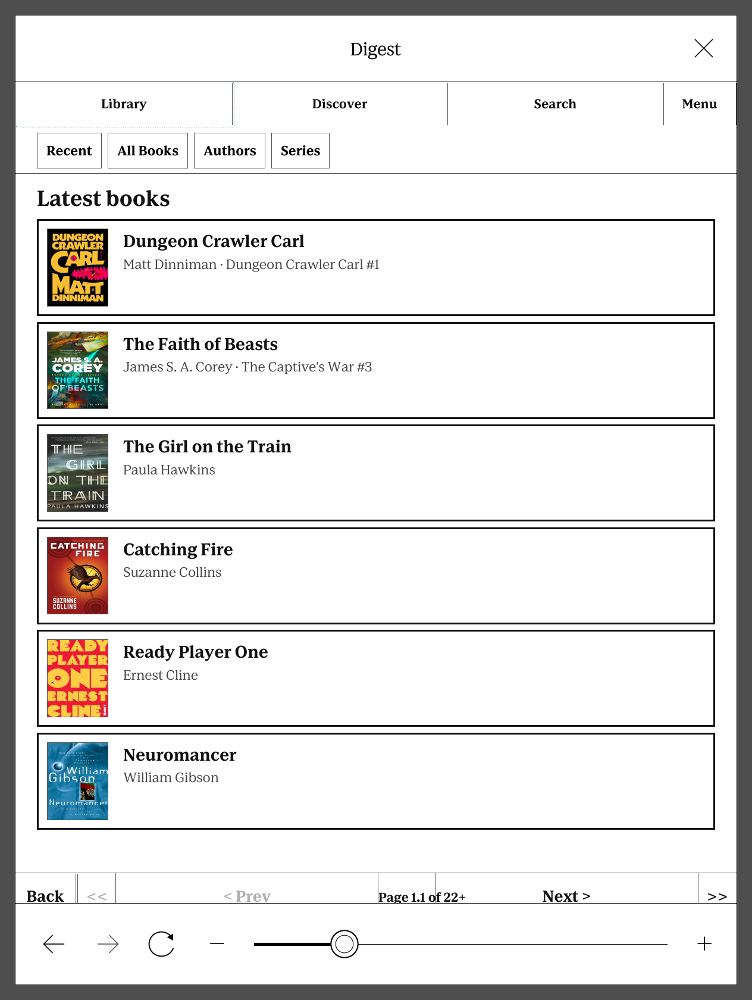
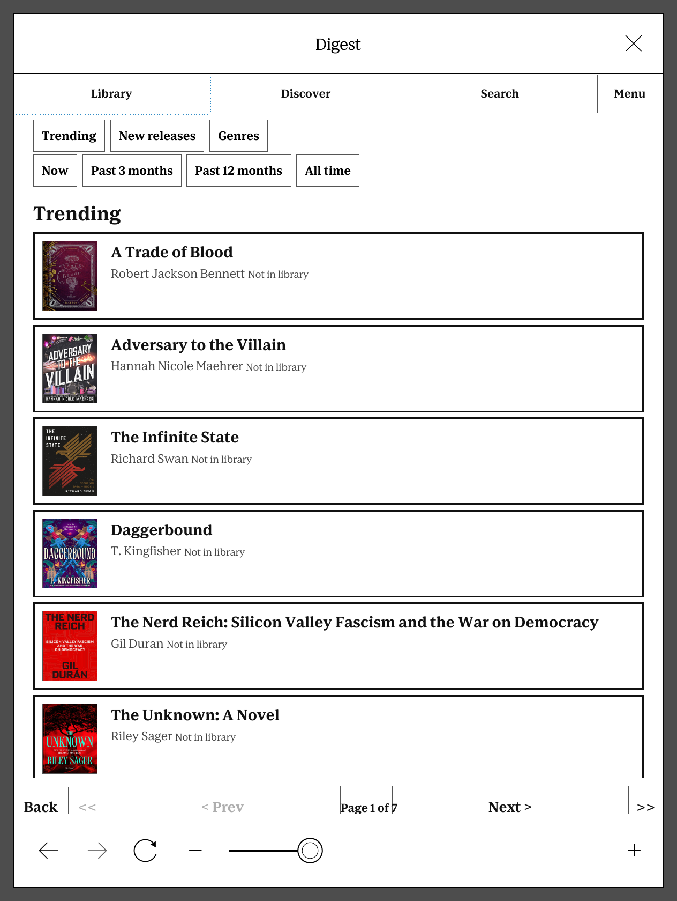

# Digest

Digest is a self-hosted, central hub for your ebook library — catalogue it,
organise it, enrich it with metadata, and manage the entire download lifecycle,
all without leaving the browser already built into your Kindle or Kobo.

Most self-hosted library tools assume you manage your books from a desktop and
just *read* on the device. Digest turns that around: browsing, searching,
requesting a title you don't own yet, checking on a download, fixing a bad
match — every core workflow runs from the cramped, JavaScript-light browser
baked into an e-reader, alongside a full desktop-grade interface for when
you're at a real keyboard.

## Screenshots

The same library, from either interface — pick the one that matches the
screen you're actually holding.

**Modern interface** — desktop and phone browsers:

**E-reader interface** — the native Kindle/Kobo on-device browser:

## What it does

- **Catalogue** — scans EPUB, KEPUB, MOBI, and AZW3 files, groups duplicate
  formats of the same book, and extracts whatever metadata is already embedded.
- **Organise** — approved matches are filed into canonical author/title
  folders automatically, so the library stays tidy without manual renaming.
- **Enrich** — pulls metadata and covers from Hardcover, Google Books, Open
  Library, ISBNdb, and NYT bestseller lists, with manual review and guarded
  automatic matching for anything ambiguous.
- **Acquire** — request a book you don't own and Digest can search Shelfmark
  or Prowlarr/SABnzbd, download it, and file it into the library
  automatically once it lands — tracked end to end from request to shelf.
- **Deliver** — Send-to-Kindle, an authenticated OPDS catalogue, and native
  Kobo device sync (reading progress, collections, covers) get books onto
  the device without a cable.

## Interfaces

- A responsive modern UI for desktop and phone browsers.
- A dedicated single-page client built for Kindle and Kobo's own on-device
  browsers — library, discovery, shelves, downloads, and account settings,
  all reachable without ever plugging the device into a computer.
- Authenticated OPDS for any OPDS-capable reader app.

## Also included

- Personal and shared shelves, including a live **All Books** shelf
- Reading-state tracking (progress, ratings, favourites) synced from Kobo
- Admin metadata-review queue for anything matched with low confidence
- PostgreSQL persistence, Alembic migrations, and durable background jobs
- Traefik-compatible HTTPS routing

## Documentation

- [INSTALL.md](INSTALL.md) — Docker Compose installation, environment variables,
  upgrades, backups, and release images
- [SETUP.md](SETUP.md) — first-run Digest configuration and Shelfmark, Prowlarr,
  and SABnzbd integration

## Container image

Published releases are available from `ghcr.io/shiggsy365/digest`. Pin a numbered
version for predictable deployments or use `latest` to follow stable releases.

## Licence

No licence has yet been selected. All rights are reserved until a licence file is
added to the repository.
